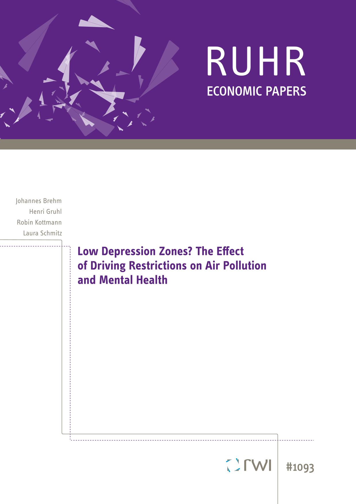

### Low Depression Zones? The Effect of Driving Restrictions on Air Pollution and Mental Health
 Johannes Brehm, Henri Gruhl, Robin Kottmann, Laura
Schmitz. "Low Depression Zones? The Effect of Driving Restrictions on Air Pollution and Mental Health." <em>Ruhr
    Economic Papers</em> 1093 (2024) 
     
    <a href="https://www.rwi-essen.de/fileadmin/user_upload/RWI/Publikationen/Ruhr_Economic_Papers/REP_24_1093.pdf">Link</a> | <a href = "../files/2024_09_25_LDZ.pdf">Download </a>  

    
Abstract

    Does exposure to air pollution impact mental health? This paper uses administrative health insurance data to
    estimate the medium-term cumulative effects of air pollution exposure on mental health outcomes. For identification,
    we exploit the staggered introduction of Low Emission Zones (LEZs) across German cities, which restrict access for
    emission-intensive vehicles. We find that LEZs reduce various air pollutants and improve the population's mental
    health measured by depression and anxiety diagnoses, prescriptions, and specialist visits. The health benefits
    emerge gradually, with younger individuals benefiting the most. Our findings suggest substantial mental health
    co-benefits and avoided health costs from improved air quality.

