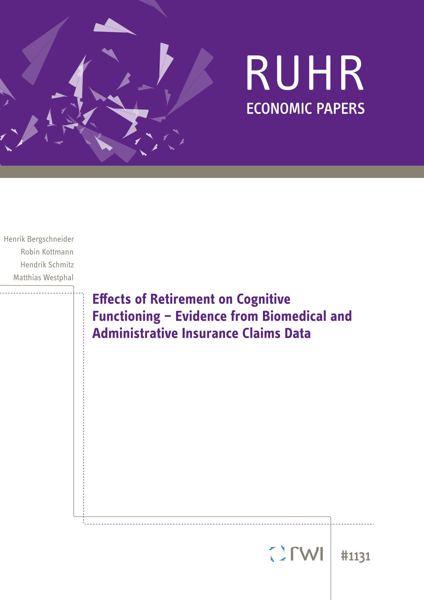
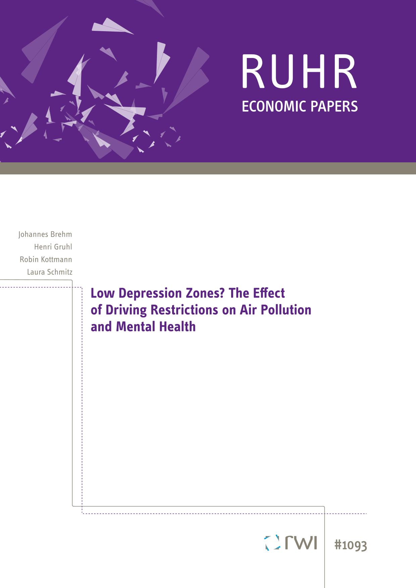

## Working Papers

### Effects of Retirement on Cognitive Functioning – Evidence from Biomedical and Administrative Insurance Claims Data
 Henrik Bergschneider, Robin Kottmann, Hendrik Schmitz, Matthias Westphal. "Effects of Retirement on Cognitive Functioning – Evidence from Biomedical and Administrative Insurance Claims Data." <em>Ruhr
    Economic Papers</em> 1131 (2024) 
     
    <a href="https://www.rwi-essen.de/publikationen/wissenschaftlich/ruhr-economic-papers/detail/effects-of-retirement-on-cognitive-functioning-evidence-7265">Link</a> | <a href = "../files/2024_12_20_RCD.pdf">Download </a>  

    
Abstract

   We study the effects of retirement on cognitive functioning among women aged 63 to 67 by exploiting a German retirement reform that raised the early retirement age for women born after 1951 by three years, from 60 to 63. Our indicators of cognitive functioning are experimental measures (word recall, semantic fluency, and the Stroop test) from a large biomedical data set, as well as the diagnosis of cognitive disorders from administrative health insurance claims. We find reductions of around 12% of a standard deviation per year in retirement for measures of fluid intelligence and of an insignificant 6% for crystallized intelligence. The diagnosis of cognitive disorders remains unaffected.

### Low Depression Zones? The Effect of Driving Restrictions on Air Pollution and Mental Health
 Johannes Brehm, Henri Gruhl, Robin Kottmann, Laura
Schmitz. "Low Depression Zones? The Effect of Driving Restrictions on Air Pollution and Mental Health." <em>Ruhr
    Economic Papers</em> 1093 (2024) 
     
    <a href="https://www.rwi-essen.de/fileadmin/user_upload/RWI/Publikationen/Ruhr_Economic_Papers/REP_24_1093.pdf">Link</a> | <a href = "../files/2024_09_25_LDZ.pdf">Download </a>  

    
Abstract

    Does exposure to air pollution impact mental health? This paper uses administrative health insurance data to estimate the medium-term cumulative effects of air pollution exposure on mental health outcomes. For identification, we exploit the staggered introduction of Low Emission Zones (LEZs) across German cities, which restrict access for emission-intensive vehicles. We find that LEZs reduce various air pollutants and improve the population's mental health measured by depression and anxiety diagnoses, prescriptions, and specialist visits. The health benefits emerge gradually, with younger individuals benefiting the most. Our findings suggest substantial mental health co-benefits and avoided health costs from improved air quality.

## Work in Progress

### Are treatment decisions in health care markets efficient? Implications from heterogeneous treatment effects of heart attack patients
Robin Kottmann, Hendrik Schmitz, Matthias Westphal, Ansgar Wübker