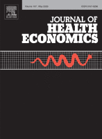
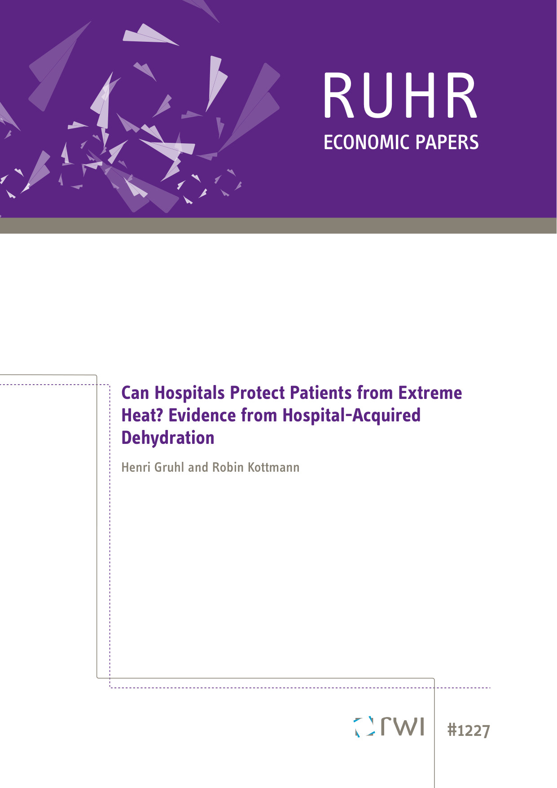
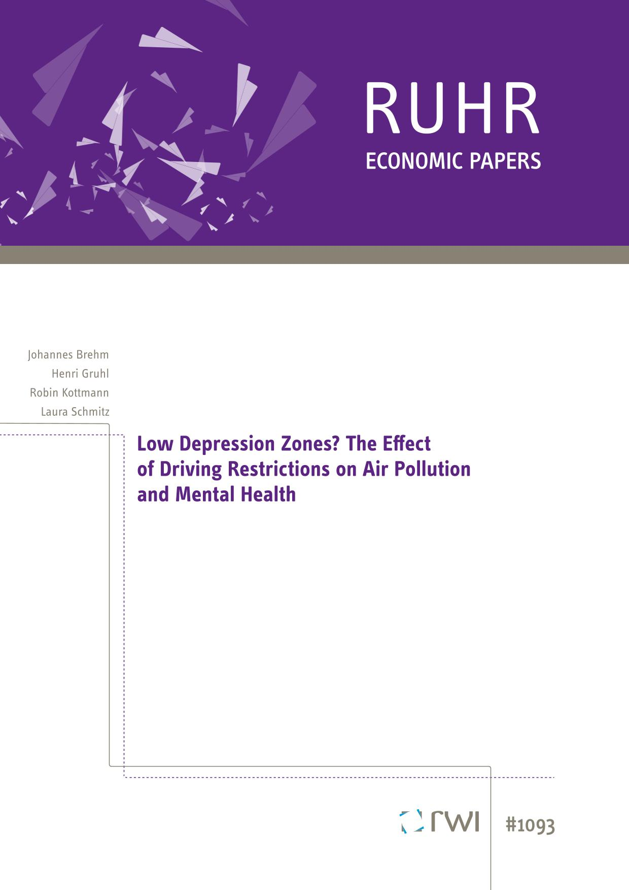

## Published Papers

### Retirement and cognitive abilities: Evidence from the German early retirement age reform for women 
 Henrik Bergschneider, Robin Kottmann, Hendrik Schmitz, Matthias Westphal. "Retirement and cognitive abilities: Evidence from the German early retirement age reform for women." <em>Journal of Health Economics</em>, Vol. 108, 103161 (2026).
     
    <a href="https://www.sciencedirect.com/science/article/pii/S0167629626000597">Link</a> 

    
Abstract

   We study the effects of retirement on cognitive functioning among women aged 63 to 67 by exploiting a German retirement reform that raised the early retirement age for women born after 1951 by three years, from 60 to 63. Our indicators of cognitive functioning are objective cognitive test scores (word recall, semantic fluency, and the Stroop test) from a large biomedical dataset, as well as the diagnosis of cognitive disorders from administrative health insurance claims. We find reductions of around 13% of a standard deviation per year in retirement for measures of fluid intelligence, whereas crystallized intelligence remains unaffected. These estimates reflect the reform-induced shift in retirement duration for compliers around the eligibility cutoff. In contrast, additional years in retirement do not affect diagnosis of cognitive disorder and decrease diagnoses of dementia-related risk factors such as hypertension, depression, and sleep problems. The improvement in health outcomes suggests that cognitive decline is not driven by health deterioration but might possibly be due to reduced cognitive engagement after leaving work.

## Working Papers

### Can Hospitals Protect Patients from Extreme Heat? Evidence from Hospital-Acquired Dehydration
 Henri Gruhl, Robin Kottmann. "Can Hospitals Protect Patients from Extreme Heat? Evidence from Hospital-Acquired Dehydration." <em>Ruhr
    Economic Papers</em> 1227 (2026) . <strong>Submitted.</strong> 
     
    <a href="https://www.rwi-essen.de/fileadmin/user_upload/RWI/Publikationen/Ruhr_Economic_Papers/REP_26_1227.pdf">Link</a> 

    
Abstract

    Is the healthcare system equipped to protect patients from extreme heat? Linking daily temperatures to administrative records covering 41.3 million German hospital admissions, we examine hospital-acquired dehydration among patients without dehydration at admission. Relative to stays at 15–20°C, exposure above 30°C increases dehydration by 0.63 percentage points (17%) and acute kidney failure, an objective dehydration-related outcome, by 0.08 percentage points (4.7%). Effects are concentrated among older patients and those with dementia. Our findings show that extreme heat not only increases demand for care, but also compromises patient protection within hospitals, highlighting the need for adaptation to prevent avoidable in-hospital deterioration.

### Environmental Regulation and Mental Health: Evidence from Driving Restrictions
 Johannes Brehm, Henri Gruhl, Robin Kottmann, Laura
Schmitz. "Low Depression Zones? The Effect of Driving Restrictions on Air Pollution and Mental Health." <em>Ruhr
    Economic Papers</em> 1093 (2024) . <strong>Revise and Resubmit at Journal of Environmental Economics and Management.</strong> 
     
    <a href="https://www.rwi-essen.de/fileadmin/user_upload/RWI/Publikationen/Ruhr_Economic_Papers/REP_24_1093.pdf">Link</a> 

    
Abstract

    Does exposure to air pollution impact mental health? This paper uses administrative health insurance data to estimate the medium-term cumulative effects of air pollution exposure on mental health outcomes. For identification, we exploit the staggered introduction of Low Emission Zones (LEZs) across German cities, which restrict access for emission-intensive vehicles. We find that LEZs reduce various air pollutants and improve the population's mental health measured by depression and anxiety diagnoses, prescriptions, and specialist visits. The health benefits emerge gradually, with younger individuals benefiting the most. Our findings suggest substantial mental health co-benefits and avoided health costs from improved air quality.

## Work in Progress

### Ambient Temperature and the Risk of Hospital-Acquired Infections.
Robin Kottmann. <strong>Draft on request. </strong> 
     
    

    
Abstract

    This study estimates how short-run exposure to extreme temperatures affects hospital-acquired infections (HAIs). Using German administrative health data (2005-2023) linked to local weather, I exploit quasi-random daily temperature variation during the first three days of admission. I find that extreme heat significantly increases HAI risk: each day ≥30°C raises infection probability by 0.06 percentage points (1.43 percent), while extreme cold reduces it. These effects are concentrated among vulnerable patients, high-risk procedures, smaller hospitals, and historically cooler regions. These findings highlight a critical clinical channel through which climate change impacts healthcare systems.

### Retirement Duration Effects on Health
Henrik Bergschneider, Robin Kottmann, Hendrik Schmitz, Matthias Westphal